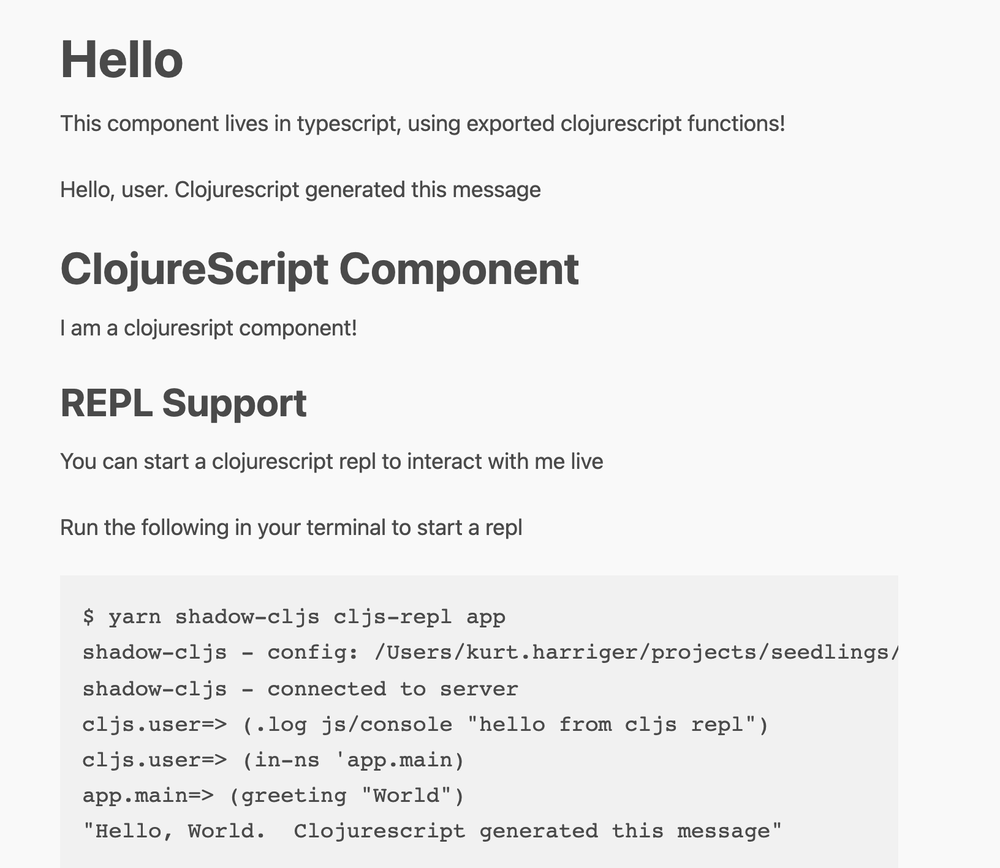

ClojureScript in Parcel Web App
----


This project demonstrates how to include ClojureScript in a Parcel based app (with working clojurescript repl).

This project also demonstrates how to export and utilize ClojureScript 
functions and components from typescript. 

Currently, you must manually start the shadow-cljs compiler as a seperate process along side parcel as noted below.

I expect that this manual step and the minimal shadow-cljs configuration can be provided by a parcel resolver plugin.  This project is just a first step to demonstrate a workable configuration that can subsequently be automated.  

 https://github.com/parcel-bundler/parcel/issues/1388 


### Develop

Run in development:

```bash
$ yarn

yarn install v1.22.17
[1/4] 🔍  Resolving packages...
[2/4] 🚚  Fetching packages...
[3/4] 🔗  Linking dependencies...
[4/4] 🔨  Building fresh packages...
✨  Done in 11.28s.

$ yarn shadow-cljs watch app  

yarn run v1.22.17
shadow-cljs - config: shadow-cljs.edn
shadow-cljs - updating dependencies
shadow-cljs - dependencies updated
shadow-cljs - server version: 2.16.9 running at http://localhost:9630
shadow-cljs - nREPL server started on port 55551
shadow-cljs - watching build :app
[:app] Configuring build.
[:app] Compiling ...
[:app] Build completed. (149 files, 147 compiled, 0 warnings, 15.12s)
```
In a second terminal
```bash 

$ yarn parcel index.html

Server running at http://localhost:1234
✨ Built in 2.58s
```

Now open http://localhost:1234 in your browser.



### REPL

After page is loaded, you may also start a REPL connected to browser with:

```bash
yarn shadow-cljs cljs-repl app
```

## Aliases

This demo project currently uses aliases cljs/<namespace> in package.json
instead of using ./target/<namespace>.js in source files, but an alias would need to be added for each file you import from typescript.  
In theory, these aliases would be provided automatically by a parcel resolver plugin.

### Release

Compile with optimizations with `release` sub-command:

```bash
yarn shadow-cljs release app
```

Read docs for more http://doc.shadow-cljs.org/ .


## References 

* Guide on using npm modules from clojurescript
https://clojureverse.org/t/guide-on-how-to-use-import-npm-modules-packages-in-clojurescript/2298

* Feedback from shadow-cljs author
https://clojurians.slack.com/archives/C6N245JGG/p1640735253378600

* External modules in parcel
https://www.npmjs.com/package/parcel-plugin-externals
https://github.com/parcel-bundler/parcel/issues/144

* Generating ES Modules with shadow-cljs 
 https://clojureverse.org/t/generating-es-modules-browser-deno/6116
 Note: shadow-cljs author recommends using npm-module target over esm target

* ESM demo for shadow-cljs 
https://github.com/minimal-xyz/minimal-shadow-cljs-esm
Note: shadow-cljs author recommends using npm-module target over esm target


### License

MIT
